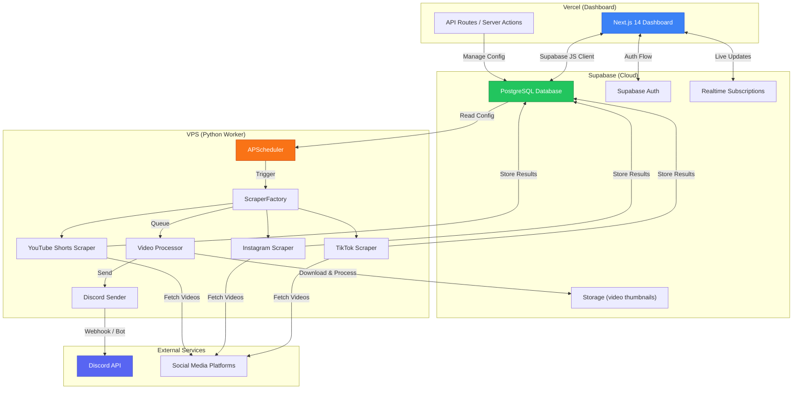
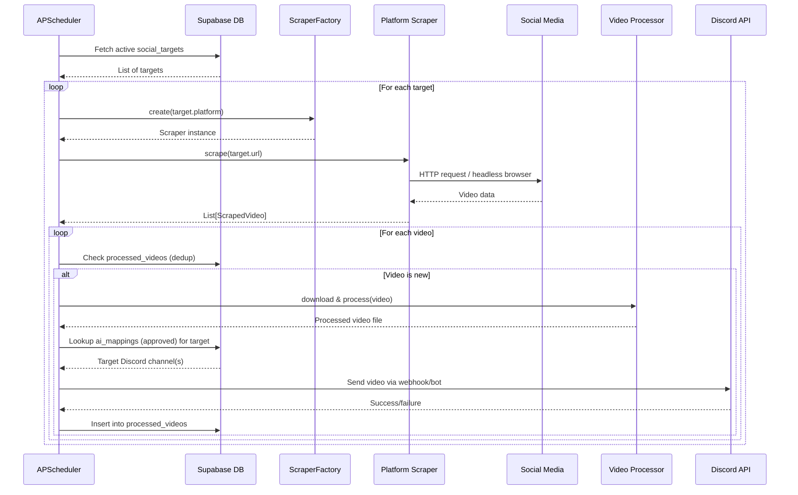
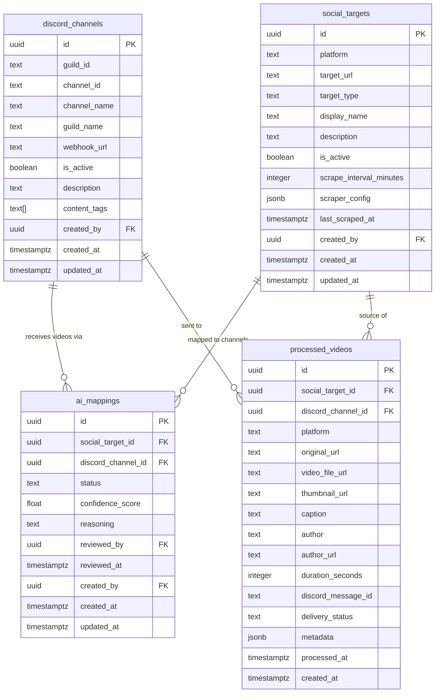
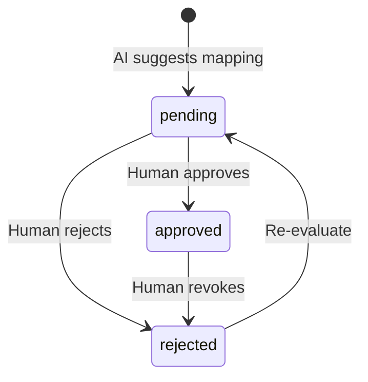

# 🏛️ ARCHITECTURE-SPEC.md — System Architecture & Database Schema

> **Project**: Automated Social Media Video Scraper to Discord  
> **Version**: 1.0.0  
> **Last Updated**: 2026-05-23  
> **Owner**: Antigravity (Claude Opus)

---

## 1. System Overview

This system automatically scrapes videos from social media platforms (TikTok, Instagram Reels, YouTube Shorts, X/Twitter) and delivers them to specified Discord channels. An AI layer suggests optimal mappings between content sources and Discord channels, with human approval via a web dashboard.

### High-Level Architecture



---

## 2. Component Details

### 2.1 Vercel Dashboard (Next.js 14)

**Purpose**: Web UI for managing the scraping system — configuring Discord channels, social media targets, reviewing AI-suggested mappings, and monitoring processed videos.

| Feature | Route | Description |
|---------|-------|-------------|
| Login | `/login` | Supabase Auth (email/password or OAuth) |
| Dashboard Home | `/dashboard` | Overview stats: total videos processed, active targets, pending mappings |
| Channel Manager | `/dashboard/channels` | CRUD operations on `discord_channels` |
| Target Manager | `/dashboard/targets` | CRUD operations on `social_targets` |
| AI Mapping Review | `/dashboard/mappings` | Approve/reject AI-suggested source→channel mappings |
| Video History | `/dashboard/videos` | Browse `processed_videos` with filters and search |

**Key Technical Decisions**:
- Server Components by default for data fetching
- Client Components only for interactive elements (forms, modals, real-time updates)
- Supabase Realtime for live dashboard updates when new videos are processed
- RLS policies enforce that users only see their own data

### 2.2 Supabase (PostgreSQL + Auth + Storage)

**Purpose**: Central data store, authentication provider, and file storage for the entire system. Acts as the communication layer between the Dashboard and the VPS Worker.

**Why Supabase**:
- Managed PostgreSQL with built-in RLS
- Realtime subscriptions for live dashboard updates
- Auto-generated REST and GraphQL APIs
- Built-in Auth with multiple providers
- Storage for video thumbnails and metadata
- Free tier sufficient for MVP

### 2.3 VPS Python Worker

**Purpose**: Runs continuously on a VPS, executing scraping jobs on a schedule, processing videos, and sending them to Discord.

**Runtime Environment**:
- Ubuntu 22.04+ or Debian 12
- Python 3.11+
- Docker containerized (optional but recommended)
- Managed by `systemd` or `supervisord`

**Execution Flow**:



---

## 3. Supabase Database Schema

### 3.1 Entity Relationship Diagram



### 3.2 Table Definitions

---

#### Table: `discord_channels`

Stores Discord channel configurations where scraped videos will be delivered.

| Column | Type | Constraints | Default | Description |
|--------|------|-------------|---------|-------------|
| `id` | `uuid` | `PRIMARY KEY` | `gen_random_uuid()` | Unique identifier |
| `guild_id` | `text` | `NOT NULL` | — | Discord server (guild) ID |
| `channel_id` | `text` | `NOT NULL, UNIQUE` | — | Discord channel ID (unique to prevent duplicates) |
| `channel_name` | `text` | `NOT NULL` | — | Human-readable channel name |
| `guild_name` | `text` | `NOT NULL` | — | Human-readable server name |
| `webhook_url` | `text` | — | `NULL` | Discord webhook URL for sending messages (optional if using bot) |
| `is_active` | `boolean` | `NOT NULL` | `true` | Whether this channel is active for receiving videos |
| `description` | `text` | — | `NULL` | Optional description of the channel's purpose/content theme |
| `content_tags` | `text[]` | — | `'{}'` | Tags describing desired content (e.g., `['funny', 'memes', 'cooking']`) — used by AI for mapping suggestions |
| `created_by` | `uuid` | `REFERENCES auth.users(id)` | `auth.uid()` | User who added this channel |
| `created_at` | `timestamptz` | `NOT NULL` | `now()` | Record creation timestamp |
| `updated_at` | `timestamptz` | `NOT NULL` | `now()` | Last modification timestamp |

**Indexes**:
- `idx_discord_channels_guild_id` on `guild_id`
- `idx_discord_channels_is_active` on `is_active`
- Unique constraint on `channel_id`

**RLS Policies**:
- Users can only SELECT/INSERT/UPDATE/DELETE their own rows (`created_by = auth.uid()`)
- Service role bypasses RLS (for VPS worker)

---

#### Table: `social_targets`

Stores social media profiles/pages/hashtags to scrape for videos.

| Column | Type | Constraints | Default | Description |
|--------|------|-------------|---------|-------------|
| `id` | `uuid` | `PRIMARY KEY` | `gen_random_uuid()` | Unique identifier |
| `platform` | `text` | `NOT NULL, CHECK (platform IN ('tiktok', 'instagram', 'youtube', 'twitter'))` | — | Social media platform identifier |
| `target_url` | `text` | `NOT NULL` | — | URL of the profile, page, or hashtag to scrape |
| `target_type` | `text` | `NOT NULL, CHECK (target_type IN ('profile', 'hashtag', 'playlist', 'search'))` | `'profile'` | Type of scraping target |
| `display_name` | `text` | `NOT NULL` | — | Human-readable name (e.g., `@username` or `#hashtag`) |
| `description` | `text` | — | `NULL` | Optional description of content expected from this target |
| `is_active` | `boolean` | `NOT NULL` | `true` | Whether scraping is enabled for this target |
| `scrape_interval_minutes` | `integer` | `NOT NULL, CHECK (scrape_interval_minutes >= 5)` | `30` | How often to scrape this target (minimum 5 minutes) |
| `scraper_config` | `jsonb` | — | `'{}'` | Platform-specific configuration (e.g., max videos per scrape, filters) |
| `last_scraped_at` | `timestamptz` | — | `NULL` | Timestamp of the last successful scrape |
| `created_by` | `uuid` | `REFERENCES auth.users(id)` | `auth.uid()` | User who added this target |
| `created_at` | `timestamptz` | `NOT NULL` | `now()` | Record creation timestamp |
| `updated_at` | `timestamptz` | `NOT NULL` | `now()` | Last modification timestamp |

**Indexes**:
- `idx_social_targets_platform` on `platform`
- `idx_social_targets_is_active` on `is_active`
- `idx_social_targets_last_scraped` on `last_scraped_at`
- Unique constraint on `(platform, target_url)` to prevent duplicate targets

**RLS Policies**:
- Users can only SELECT/INSERT/UPDATE/DELETE their own rows (`created_by = auth.uid()`)
- Service role bypasses RLS (for VPS worker)

---

#### Table: `ai_mappings`

Stores AI-suggested and human-approved mappings between social media targets and Discord channels. This is the core routing table that determines where scraped videos are delivered.

| Column | Type | Constraints | Default | Description |
|--------|------|-------------|---------|-------------|
| `id` | `uuid` | `PRIMARY KEY` | `gen_random_uuid()` | Unique identifier |
| `social_target_id` | `uuid` | `NOT NULL, REFERENCES social_targets(id) ON DELETE CASCADE` | — | The source social media target |
| `discord_channel_id` | `uuid` | `NOT NULL, REFERENCES discord_channels(id) ON DELETE CASCADE` | — | The destination Discord channel |
| `status` | `text` | `NOT NULL, CHECK (status IN ('pending', 'approved', 'rejected'))` | `'pending'` | **Approval workflow status** — `pending`: AI suggested, awaiting human review; `approved`: Human approved, actively routing; `rejected`: Human rejected, not routing |
| `confidence_score` | `float` | `CHECK (confidence_score >= 0 AND confidence_score <= 1)` | `NULL` | AI confidence score (0.0 to 1.0) for the mapping suggestion |
| `reasoning` | `text` | — | `NULL` | AI-generated explanation of why this mapping was suggested |
| `reviewed_by` | `uuid` | `REFERENCES auth.users(id)` | `NULL` | User who approved/rejected the mapping |
| `reviewed_at` | `timestamptz` | — | `NULL` | When the mapping was reviewed |
| `created_by` | `uuid` | `REFERENCES auth.users(id)` | `auth.uid()` | User or system that created the mapping |
| `created_at` | `timestamptz` | `NOT NULL` | `now()` | Record creation timestamp |
| `updated_at` | `timestamptz` | `NOT NULL` | `now()` | Last modification timestamp |

**Indexes**:
- `idx_ai_mappings_status` on `status`
- `idx_ai_mappings_social_target` on `social_target_id`
- `idx_ai_mappings_discord_channel` on `discord_channel_id`
- Unique constraint on `(social_target_id, discord_channel_id)` to prevent duplicate mappings

**Status Workflow**:


**RLS Policies**:
- Users can SELECT all mappings (to review them)
- Only the `created_by` user or an admin can UPDATE status
- Service role bypasses RLS (for AI suggestion engine)

---

#### Table: `processed_videos`

Stores a record of every video that has been scraped, processed, and delivered. Acts as both a history log and a deduplication mechanism.

| Column | Type | Constraints | Default | Description |
|--------|------|-------------|---------|-------------|
| `id` | `uuid` | `PRIMARY KEY` | `gen_random_uuid()` | Unique identifier |
| `social_target_id` | `uuid` | `NOT NULL, REFERENCES social_targets(id) ON DELETE SET NULL` | — | Which target this video came from |
| `discord_channel_id` | `uuid` | `REFERENCES discord_channels(id) ON DELETE SET NULL` | `NULL` | Which channel it was sent to (NULL if not yet sent) |
| `platform` | `text` | `NOT NULL` | — | Platform where the video originated |
| `original_url` | `text` | `NOT NULL, UNIQUE` | — | Original URL of the video post (used for deduplication) |
| `video_file_url` | `text` | — | `NULL` | URL of the downloaded/processed video file in Supabase Storage |
| `thumbnail_url` | `text` | — | `NULL` | URL of the video thumbnail |
| `caption` | `text` | — | `NULL` | Original caption/description from the post |
| `author` | `text` | — | `NULL` | Author username |
| `author_url` | `text` | — | `NULL` | URL to the author's profile |
| `duration_seconds` | `integer` | — | `NULL` | Video duration in seconds |
| `discord_message_id` | `text` | — | `NULL` | Discord message ID after successful delivery (for future editing/deletion) |
| `delivery_status` | `text` | `NOT NULL, CHECK (delivery_status IN ('scraped', 'processing', 'queued', 'sent', 'failed'))` | `'scraped'` | Current delivery pipeline status |
| `metadata` | `jsonb` | — | `'{}'` | Platform-specific metadata (likes, views, hashtags, etc.) |
| `processed_at` | `timestamptz` | — | `NULL` | When the video was fully processed and sent |
| `created_at` | `timestamptz` | `NOT NULL` | `now()` | Record creation timestamp |

**Indexes**:
- `idx_processed_videos_original_url` on `original_url` (unique — dedup key)
- `idx_processed_videos_social_target` on `social_target_id`
- `idx_processed_videos_delivery_status` on `delivery_status`
- `idx_processed_videos_platform` on `platform`
- `idx_processed_videos_created_at` on `created_at DESC`

**RLS Policies**:
- Users can SELECT all processed videos
- Only service role can INSERT/UPDATE (VPS worker writes these)

---

## 4. SQL Migration Template

The following SQL should be used as the **initial migration** for Supabase. Place this file at `supabase/migrations/001_initial_schema.sql`.

```sql
-- ============================================
-- Migration: 001_initial_schema.sql
-- Description: Create core tables for CrawlStory
-- Date: 2026-05-23
-- ============================================

-- Enable required extensions
CREATE EXTENSION IF NOT EXISTS "uuid-ossp";

-- ============================================
-- Table: discord_channels
-- ============================================
CREATE TABLE public.discord_channels (
    id              uuid PRIMARY KEY DEFAULT gen_random_uuid(),
    guild_id        text NOT NULL,
    channel_id      text NOT NULL UNIQUE,
    channel_name    text NOT NULL,
    guild_name      text NOT NULL,
    webhook_url     text,
    is_active       boolean NOT NULL DEFAULT true,
    description     text,
    content_tags    text[] DEFAULT '{}',
    created_by      uuid REFERENCES auth.users(id) DEFAULT auth.uid(),
    created_at      timestamptz NOT NULL DEFAULT now(),
    updated_at      timestamptz NOT NULL DEFAULT now()
);

CREATE INDEX idx_discord_channels_guild_id ON public.discord_channels(guild_id);
CREATE INDEX idx_discord_channels_is_active ON public.discord_channels(is_active);

COMMENT ON TABLE public.discord_channels IS 'Discord channels configured to receive scraped videos';
COMMENT ON COLUMN public.discord_channels.content_tags IS 'Tags for AI mapping (e.g., funny, cooking, memes)';

-- ============================================
-- Table: social_targets
-- ============================================
CREATE TABLE public.social_targets (
    id                      uuid PRIMARY KEY DEFAULT gen_random_uuid(),
    platform                text NOT NULL CHECK (platform IN ('tiktok', 'instagram', 'youtube', 'twitter')),
    target_url              text NOT NULL,
    target_type             text NOT NULL DEFAULT 'profile' CHECK (target_type IN ('profile', 'hashtag', 'playlist', 'search')),
    display_name            text NOT NULL,
    description             text,
    is_active               boolean NOT NULL DEFAULT true,
    scrape_interval_minutes integer NOT NULL DEFAULT 30 CHECK (scrape_interval_minutes >= 5),
    scraper_config          jsonb DEFAULT '{}',
    last_scraped_at         timestamptz,
    created_by              uuid REFERENCES auth.users(id) DEFAULT auth.uid(),
    created_at              timestamptz NOT NULL DEFAULT now(),
    updated_at              timestamptz NOT NULL DEFAULT now(),
    UNIQUE (platform, target_url)
);

CREATE INDEX idx_social_targets_platform ON public.social_targets(platform);
CREATE INDEX idx_social_targets_is_active ON public.social_targets(is_active);
CREATE INDEX idx_social_targets_last_scraped ON public.social_targets(last_scraped_at);

COMMENT ON TABLE public.social_targets IS 'Social media profiles/hashtags/pages to scrape for videos';

-- ============================================
-- Table: ai_mappings
-- ============================================
CREATE TABLE public.ai_mappings (
    id                  uuid PRIMARY KEY DEFAULT gen_random_uuid(),
    social_target_id    uuid NOT NULL REFERENCES public.social_targets(id) ON DELETE CASCADE,
    discord_channel_id  uuid NOT NULL REFERENCES public.discord_channels(id) ON DELETE CASCADE,
    status              text NOT NULL DEFAULT 'pending' CHECK (status IN ('pending', 'approved', 'rejected')),
    confidence_score    float CHECK (confidence_score >= 0 AND confidence_score <= 1),
    reasoning           text,
    reviewed_by         uuid REFERENCES auth.users(id),
    reviewed_at         timestamptz,
    created_by          uuid REFERENCES auth.users(id) DEFAULT auth.uid(),
    created_at          timestamptz NOT NULL DEFAULT now(),
    updated_at          timestamptz NOT NULL DEFAULT now(),
    UNIQUE (social_target_id, discord_channel_id)
);

CREATE INDEX idx_ai_mappings_status ON public.ai_mappings(status);
CREATE INDEX idx_ai_mappings_social_target ON public.ai_mappings(social_target_id);
CREATE INDEX idx_ai_mappings_discord_channel ON public.ai_mappings(discord_channel_id);

COMMENT ON TABLE public.ai_mappings IS 'AI-suggested and human-approved mappings between social targets and Discord channels';
COMMENT ON COLUMN public.ai_mappings.status IS 'Workflow: pending (AI suggested) -> approved/rejected (human reviewed)';

-- ============================================
-- Table: processed_videos
-- ============================================
CREATE TABLE public.processed_videos (
    id                  uuid PRIMARY KEY DEFAULT gen_random_uuid(),
    social_target_id    uuid NOT NULL REFERENCES public.social_targets(id) ON DELETE SET NULL,
    discord_channel_id  uuid REFERENCES public.discord_channels(id) ON DELETE SET NULL,
    platform            text NOT NULL,
    original_url        text NOT NULL UNIQUE,
    video_file_url      text,
    thumbnail_url       text,
    caption             text,
    author              text,
    author_url          text,
    duration_seconds    integer,
    discord_message_id  text,
    delivery_status     text NOT NULL DEFAULT 'scraped' CHECK (delivery_status IN ('scraped', 'processing', 'queued', 'sent', 'failed')),
    metadata            jsonb DEFAULT '{}',
    processed_at        timestamptz,
    created_at          timestamptz NOT NULL DEFAULT now()
);

CREATE INDEX idx_processed_videos_social_target ON public.processed_videos(social_target_id);
CREATE INDEX idx_processed_videos_delivery_status ON public.processed_videos(delivery_status);
CREATE INDEX idx_processed_videos_platform ON public.processed_videos(platform);
CREATE INDEX idx_processed_videos_created_at ON public.processed_videos(created_at DESC);

COMMENT ON TABLE public.processed_videos IS 'History of all scraped and delivered videos (dedup via original_url)';

-- ============================================
-- Auto-update updated_at trigger
-- ============================================
CREATE OR REPLACE FUNCTION public.handle_updated_at()
RETURNS TRIGGER AS $$
BEGIN
    NEW.updated_at = now();
    RETURN NEW;
END;
$$ LANGUAGE plpgsql;

CREATE TRIGGER set_updated_at_discord_channels
    BEFORE UPDATE ON public.discord_channels
    FOR EACH ROW EXECUTE FUNCTION public.handle_updated_at();

CREATE TRIGGER set_updated_at_social_targets
    BEFORE UPDATE ON public.social_targets
    FOR EACH ROW EXECUTE FUNCTION public.handle_updated_at();

CREATE TRIGGER set_updated_at_ai_mappings
    BEFORE UPDATE ON public.ai_mappings
    FOR EACH ROW EXECUTE FUNCTION public.handle_updated_at();

-- ============================================
-- Row-Level Security (RLS)
-- ============================================
ALTER TABLE public.discord_channels ENABLE ROW LEVEL SECURITY;
ALTER TABLE public.social_targets ENABLE ROW LEVEL SECURITY;
ALTER TABLE public.ai_mappings ENABLE ROW LEVEL SECURITY;
ALTER TABLE public.processed_videos ENABLE ROW LEVEL SECURITY;

-- discord_channels: Users manage their own channels
CREATE POLICY "Users can view own channels"
    ON public.discord_channels FOR SELECT
    USING (created_by = auth.uid());

CREATE POLICY "Users can insert own channels"
    ON public.discord_channels FOR INSERT
    WITH CHECK (created_by = auth.uid());

CREATE POLICY "Users can update own channels"
    ON public.discord_channels FOR UPDATE
    USING (created_by = auth.uid());

CREATE POLICY "Users can delete own channels"
    ON public.discord_channels FOR DELETE
    USING (created_by = auth.uid());

-- social_targets: Users manage their own targets
CREATE POLICY "Users can view own targets"
    ON public.social_targets FOR SELECT
    USING (created_by = auth.uid());

CREATE POLICY "Users can insert own targets"
    ON public.social_targets FOR INSERT
    WITH CHECK (created_by = auth.uid());

CREATE POLICY "Users can update own targets"
    ON public.social_targets FOR UPDATE
    USING (created_by = auth.uid());

CREATE POLICY "Users can delete own targets"
    ON public.social_targets FOR DELETE
    USING (created_by = auth.uid());

-- ai_mappings: All authenticated users can view; only creator can modify
CREATE POLICY "Authenticated users can view all mappings"
    ON public.ai_mappings FOR SELECT
    USING (auth.role() = 'authenticated');

CREATE POLICY "Users can insert mappings"
    ON public.ai_mappings FOR INSERT
    WITH CHECK (created_by = auth.uid());

CREATE POLICY "Users can update own mappings"
    ON public.ai_mappings FOR UPDATE
    USING (created_by = auth.uid());

-- processed_videos: All authenticated users can view
CREATE POLICY "Authenticated users can view all videos"
    ON public.processed_videos FOR SELECT
    USING (auth.role() = 'authenticated');

-- Service role (VPS worker) can do everything — handled by Supabase service_role key
```

---

## 5. Data Flow Patterns

### 5.1 Video Scraping & Delivery Pipeline

```
1. Scheduler triggers → reads active `social_targets` from DB
2. For each target → ScraperFactory.create(platform) → scraper.scrape(url)
3. For each scraped video:
   a. Check `processed_videos.original_url` for dedup
   b. If new → INSERT into `processed_videos` (status: 'scraped')
   c. Download & process video → UPDATE status to 'processing'
   d. Lookup `ai_mappings` WHERE social_target_id = target.id AND status = 'approved'
   e. For each approved mapping → send to Discord channel
   f. UPDATE `processed_videos` (status: 'sent', discord_message_id, processed_at)
   g. On failure → UPDATE status to 'failed', log error
```

### 5.2 AI Mapping Suggestion Flow

```
1. When a new `social_target` is created:
   a. Analyze target's content (description, platform, display_name)
   b. Compare against `discord_channels.content_tags`
   c. Generate mapping suggestions with confidence scores
   d. INSERT into `ai_mappings` (status: 'pending', confidence_score, reasoning)
2. Dashboard shows pending mappings to the user
3. User approves/rejects → UPDATE status + reviewed_by + reviewed_at
4. Approved mappings become active routing rules
```

---

## 6. API & Communication Patterns

### 6.1 VPS Worker → Supabase

- Uses **Supabase Python client** (`supabase-py`) with the **service role key**
- Service role key bypasses RLS — used only by the VPS worker
- All reads/writes go through the Supabase REST API

### 6.2 Dashboard → Supabase

- Uses **Supabase JS client** (`@supabase/supabase-js`) with the **anon key**
- All operations are subject to RLS policies
- Real-time subscriptions for live updates on `processed_videos` and `ai_mappings`

### 6.3 VPS Worker → Discord

- **Primary**: Discord webhooks (for simple message sending)
- **Secondary**: Discord bot (for rich interactions, slash commands, reactions)
- Webhook URL stored in `discord_channels.webhook_url`
- Bot token stored in `.env` on the VPS

---

## 7. Security Considerations

| Concern | Mitigation |
|---------|------------|
| API key exposure | All keys in `.env`; never in source code |
| Unauthorized data access | Supabase RLS on all tables |
| Rate limiting (social media) | Configurable `scrape_interval_minutes` (min 5); exponential backoff on 429s |
| Rate limiting (Discord) | Queue-based sending with rate limit awareness |
| Data integrity | Foreign keys with CASCADE/SET NULL; unique constraints for dedup |
| VPS compromise | Service role key rotatable; minimal permissions on VPS user |

---

## 8. Deployment Overview

| Component | Platform | Deploy Method | Domain |
|-----------|----------|---------------|--------|
| Dashboard | Vercel | Git push → auto-deploy | `crawlstory.vercel.app` (or custom domain) |
| Database | Supabase | Managed — migrations via CLI | `*.supabase.co` |
| Worker | VPS (e.g., Hetzner, DigitalOcean) | Docker + systemd | N/A (internal) |

---

## 9. Future Considerations

- **Scaling**: If scraping volume grows, migrate worker to a task queue (Celery + Redis)
- **Multi-tenancy**: Current schema supports multi-user via `created_by`; could add `organization_id` later
- **Analytics**: Add a `video_analytics` table for tracking engagement metrics post-delivery
- **Content Moderation**: Add an AI content filter before delivery (NSFW detection, spam filtering)
- **Platform Expansion**: The Factory Pattern makes adding new scrapers (Reddit, Threads, Bluesky) trivial
